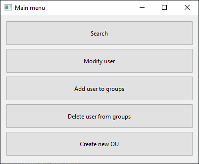
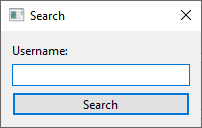
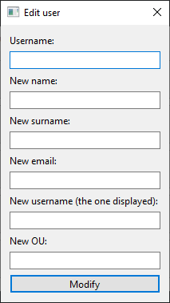
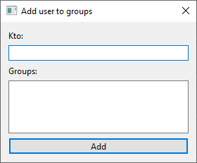
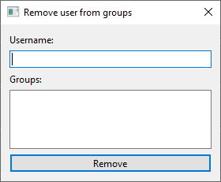
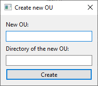
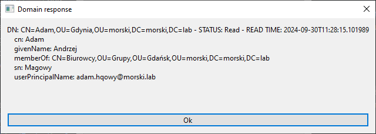
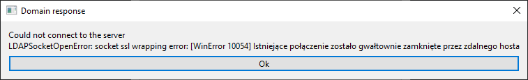

# PyDomainController - domain controller in Python
A domain controller written in Python executing simple 
operations on it.

## Table of contents
- [General Info](#general-info)
- [Technologies](#technologies)
- [Setup](#setup)
- [Explanation of the code](#explanation-of-the-code)

## General Info
This project is a simple Windows domain controller using ldap3 library.
It allows for displaying user's info, modifying them and also for creating new organizational units.
All of this is available via GUI made with PyQt6 library.

## Technologies
All the external libraries and their versions used in this project are listed in "requirements.txt".
Ldap3 is used for connecting and communicating with the domain. PyQt6 is used for the GUI. Python dotenv 
is used for reading necessary info about domain address and login credentials. This projects assumes that the domain 
doesn't use any form of security, TLS or SSL.

## Setup
The requirements consist of all the libraries that need to be installed. This project also requires a ".env" file to be 
in the same directory as the [pydomaincontroller.py](Scripts_and_necessary_files/pydomaincontroller.py) script. The ".env" file should be built like this:  
LDAP_SERVER=ldap://<domain IP address\>  
LDAP_USER=<distinguished name of the user that you are logging as\>  
LDAP_PASSWORD=<password to that account\>  
LDAP_BASE_DN=<distinguished name of the root of the directory\>  
where: 
LDAP_SERVER is the IP address of the domain. This projects assumes that the domain uses insecure connection. 
In order to use TLS or SSL connection the code needs to be modified, [pydomaincontroller.py](Scripts_and_necessary_files/pydomaincontroller.py) script in particular.  
LDAP_USER is the distinguished name of the user that you are logging as. For example, it could look like this: 
LDAP_USER=cn=main,ou=morski,dc=morski,dc=lab.  
LDAP_PASSWORD is the password to the mentioned account.  
LDAP_BASE_DN is the distinguished name of the root of the domain. It could look like this: LDAP_BASE_DN=dc=morski,dc=lab.

## Explanation of the code
### [main.py](Scripts_and_necessary_files/main.py)
This is the main script of the project. Only this file needs to be run in order for the project to work correctly.
After the script is run this window shows up:
  
"Search" option allows for searching users inside the domain, "Modify user" option allows for
modyfing user details, "Add user to groups" allows for adding users to groups and 
"Remove user from groups" allows for deleting the former from the latter. "Create new OU" allows for creating 
new organizational units. 
### [dialog_windows.py](Scripts_and_necessary_files/dialog_window.py)
This script opens a window where all the necessary data should be inserted for the selected option. This script is also 
responsible for displaying any information coming back from the domain, that includes requested data but also any errors 
that occurred along the way. Here are the examples of the responses that this script may generate:  
   
   
 
### [pydomaincontroller.py](Scripts_and_necessary_files/pydomaincontroller.py)
This script is responsible for connecting and talking to the domain. Inside of it, the DSA LDAP server is being 
specified and connection is being authenticated with data from the ".env" file. The ldap3.Server object is set to insecure 
connection with info being gathered in server.info and server.schema. The ldap3.Connection object is set to "SYNC" 
connection strategy. This script is also responsible for detecting any occurring errors and returning it to the 
[dialog_windows.py](Scripts_and_necessary_files/dialog_window.py) usually in a form of a text with error number and error description.